<div align="center">

# Project IGI Trainer

### A tool to finally beat the mission that haunted my childhood.


<br>

[Download the Latest Release](../../releases/latest) • [Build from Source](BUILD.md)

</div>

---

## The Story

Project I.G.I. has been one of my favorite childhood games since 2008. I played it again and again, but one mission always stopped me: **Border Crossing**.

I would move carefully, save ammunition, and avoid damage. Then the helicopter would appear and keep attacking from above. The tank made the area harder. The guard with the Dragunov became part of the memory too. I defeated that guard many times, and that guard defeated me many times back. 😂

Every attempt felt the same:

- Health became low
- Ammunition ran out
- Safe cover was difficult to find
- The helicopter kept circling
- The tank kept moving through the area
- The mission restarted
- Another attempt began

Years later, I became curious about how the game stores health, damage, magazine ammunition, and inventory quantities while a mission is running. That curiosity became **Project IGI Trainer**.

This trainer is for players who remember becoming stuck in difficult missions and want to revisit the game in a more relaxed offline experience. It is also a technical learning project built around runtime memory, pointer chains, validation, native Windows programming, and a compact Direct2D interface.

> **A favorite childhood game. A difficult border crossing. A helicopter that would not leave me alone. One old memory that became a complete technical project.**

---

## Remember Border Crossing?

<table>
<tr>
<td align="center" width="33.33%">

<br><strong>The Approach</strong>
<br><sub>Entering the exposed section carefully.</sub>
</td>
<td align="center" width="33.33%">

<br><strong>That Helicopter</strong>
<br><sub>Circling above and attacking again.</sub>
</td>
<td align="center" width="33.33%">

<br><strong>Stuck Again</strong>
<br><sub>Low health, low ammunition, another restart.</sub>
</td>
</tr>
</table>

Use screenshots captured from your own lawful offline gameplay. Remove usernames, folder paths, notifications, and other private information before publishing.

---

## What It Does

Three hotkeys. Three features. That is the whole idea.

```text
F1   Invincible
F2   Magazine Auto-Fill
F3   Inventory Auto-Max
F12  Disable every feature immediately
```

### Status Lights

- **Green:** The feature is enabled and the latest game data was valid
- **Amber:** The feature is enabled but waiting for the game or a transition
- **Gray:** The feature is off
- **Red:** A persistent access or compatibility problem was detected

The window also shows how many successful corrections each feature made during the current session.

---

## Gameplay Demonstrations

### Trainer Overview

<div align="center">

<br><sub>Game detection, mission detection, feature controls, and live counters.</sub>
</div>

### Border Crossing

<div align="center">

<br><sub>Returning to the mission that inspired the project.</sub>
</div>

### Feature Demonstrations

<table>
<tr>
<td align="center" width="50%">

<br><strong>Invincible</strong>
<br><sub>Validated accumulated damage is kept at zero.</sub>
</td>
<td align="center" width="50%">

<br><strong>Magazine Auto-Fill</strong>
<br><sub>The active magazine is restored after firing.</sub>
</td>
</tr>
</table>

<div align="center">

<br><sub>Valid inventory quantities are maintained automatically.</sub>
</div>

---

## Memory Map: The Big Picture

Memory is linear. An address is one position in the process address space. The `igi.exe` module and runtime objects occupy different ranges. The module contains pointer roots. Those roots lead to runtime objects such as the player and magazine objects.

The following diagrams are not drawn to byte scale. The left-to-right order represents lower addresses to higher addresses.

```mermaid
%%{init: {'theme':'base', 'themeVariables': {'background':'#0F1117','primaryColor':'#20263A','primaryTextColor':'#F6F3FF','primaryBorderColor':'#8E93B8','lineColor':'#B7B2CC','secondaryColor':'#1D2C35','secondaryTextColor':'#F3FAFC','secondaryBorderColor':'#7E9BAA','tertiaryColor':'#342633','tertiaryTextColor':'#FFF2FB','tertiaryBorderColor':'#A17F9D','noteBkgColor':'#332C20','noteTextColor':'#FFF7E8','noteBorderColor':'#AA946D','fontFamily':'Segoe UI'}}}%%
flowchart LR
    Low["0x00000000<br/>Lowest address"] --> Guard["0x00010000<br/>Low-address guard"]
    Guard --> Module["igi.exe module range<br/>code, data, pointer roots"]
    Module --> Mapped["Other loaded modules<br/>and mapped regions"]
    Mapped --> Runtime["Runtime allocations<br/>player, inventory, weapon objects"]
    Runtime --> High["Below 0x80000000<br/>Expected 32-bit user range"]

    style Low fill:#252A33,stroke:#777F91,color:#F1F3F7
    style Guard fill:#332C20,stroke:#AA946D,color:#FFF7E8
    style Module fill:#20263A,stroke:#8E93B8,color:#F6F3FF
    style Mapped fill:#2A2734,stroke:#8C849D,color:#F8F4FF
    style Runtime fill:#203127,stroke:#79A68A,color:#F0FFF5
    style High fill:#252A33,stroke:#777F91,color:#F1F3F7
```

The trainer accepts a resolved pointer only when it is inside this expected range:

```text
0x00010000 <= pointer < 0x80000000
```

---

## RAM Structure and Containment

This diagram shows what belongs to the module and what belongs to runtime memory.

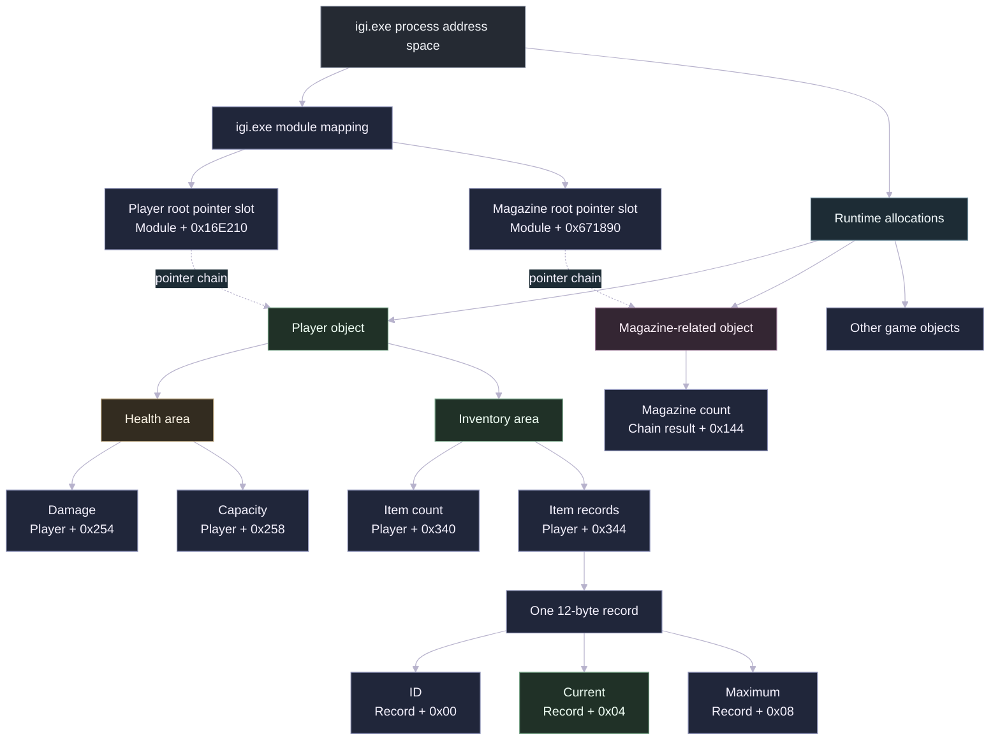

---

## Complete Memory Address Reference

This Mermaid diagram replaces a plain address table. Every known location is grouped by the object that owns it.

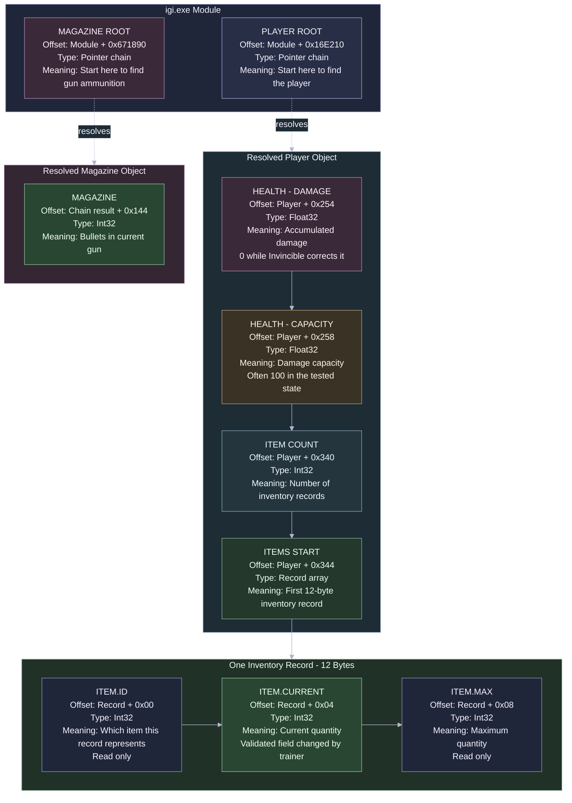

---

## Linear `igi.exe` Module Map

These known module offsets appear in increasing address order. The spaces between them contain other code and data that this trainer does not use.

```mermaid
%%{init: {'theme':'base', 'themeVariables': {'background':'#0F1117','primaryColor':'#20263A','primaryTextColor':'#F6F3FF','primaryBorderColor':'#8E93B8','lineColor':'#B7B2CC','secondaryColor':'#1D2C35','secondaryTextColor':'#F3FAFC','secondaryBorderColor':'#7E9BAA','tertiaryColor':'#342633','tertiaryTextColor':'#FFF2FB','tertiaryBorderColor':'#A17F9D','fontFamily':'Segoe UI'}}}%%
flowchart LR
    Base["Module Base<br/>igi.exe + 0x000000"] --> Before["Code and module data<br/>before 0x16E210"]
    Before --> PlayerRoot["Base + 0x16E210<br/>Player root pointer"]
    PlayerRoot --> Middle["Other module data<br/>between known roots"]
    Middle --> MagazineRoot["Base + 0x671890<br/>Magazine root pointer"]
    MagazineRoot --> After["Remaining module range"]

    style Base fill:#252A33,stroke:#777F91,color:#F1F3F7
    style Before fill:#2A2734,stroke:#8C849D,color:#F8F4FF
    style PlayerRoot fill:#282E46,stroke:#9BA1D0,color:#F7F5FF
    style Middle fill:#2A2734,stroke:#8C849D,color:#F8F4FF
    style MagazineRoot fill:#3A2938,stroke:#B188AE,color:#FFF4FC
    style After fill:#2A2734,stroke:#8C849D,color:#F8F4FF
```

---

## Player Pointer Chain

Each **read pointer** step reads a 32-bit address from memory.


```text
p0     = read_u32(module_base + 0x16E210)
p1     = read_u32(p0 + 0x08)
p2     = read_u32(p1 + 0x7CC)
player = read_u32(p2 + 0x14)
```

The final player address can change after a loading screen or mission change. The trainer resolves the chain again instead of keeping one old address.

---

## Linear Player Object Layout

The following rectangle-like chain shows the known fields in increasing offset order inside the player object.

```mermaid
%%{init: {'theme':'base', 'themeVariables': {'background':'#0F1117','primaryColor':'#20263A','primaryTextColor':'#F6F3FF','primaryBorderColor':'#8E93B8','lineColor':'#B7B2CC','secondaryColor':'#1D2C35','secondaryTextColor':'#F3FAFC','secondaryBorderColor':'#7E9BAA','tertiaryColor':'#342633','tertiaryTextColor':'#FFF2FB','tertiaryBorderColor':'#A17F9D','fontFamily':'Segoe UI'}}}%%
flowchart LR
    Start["Player + 0x000<br/>Object start"] --> UnknownA["Other player fields<br/>0x000 to 0x253"]
    UnknownA --> Damage["+0x254 to +0x257<br/>Float32 damage"]
    Damage --> Capacity["+0x258 to +0x25B<br/>Float32 capacity"]
    Capacity --> UnknownB["Other player fields<br/>0x25C to 0x33F"]
    UnknownB --> Count["+0x340 to +0x343<br/>Int32 item count"]
    Count --> Records["+0x344<br/>First 12-byte item record"]
    Records --> More["More records<br/>every +0x0C bytes"]

    style Start fill:#252A33,stroke:#777F91,color:#F1F3F7
    style UnknownA fill:#2A2734,stroke:#8C849D,color:#F8F4FF
    style Damage fill:#3A2938,stroke:#B188AE,color:#FFF4FC
    style Capacity fill:#3A3224,stroke:#B59D73,color:#FFF8E9
    style UnknownB fill:#2A2734,stroke:#8C849D,color:#F8F4FF
    style Count fill:#24353E,stroke:#86A7B5,color:#F2FBFD
    style Records fill:#294632,stroke:#8BC09A,color:#F1FFF5
    style More fill:#24382C,stroke:#84AF91,color:#F1FFF5
```

---

## Health Memory and Formula

The damage and capacity values are adjacent 4-byte floating-point fields.

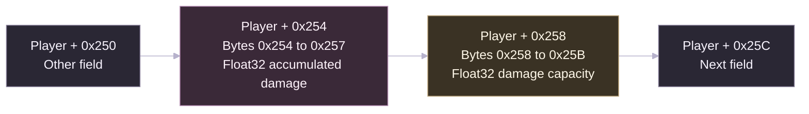

```text
Remaining Health = Capacity - Damage
Health Percentage = Remaining Health / Capacity * 100
```

Example:

```text
Capacity = 100
Damage   = 25
Health   = 75%
```

When Invincible is enabled:

```text
Damage = 0
Health = 100 - 0 = 100%
```

### Invincible Flow

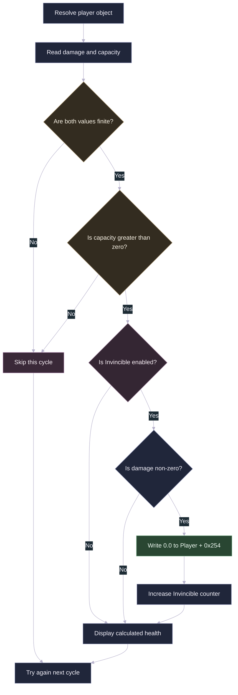

---

## Linear Inventory Layout

The inventory starts with a 4-byte count, followed immediately by fixed 12-byte records.

```mermaid
%%{init: {'theme':'base', 'themeVariables': {'background':'#0F1117','primaryColor':'#20263A','primaryTextColor':'#F6F3FF','primaryBorderColor':'#8E93B8','lineColor':'#B7B2CC','secondaryColor':'#1D2C35','secondaryTextColor':'#F3FAFC','secondaryBorderColor':'#7E9BAA','tertiaryColor':'#342633','tertiaryTextColor':'#FFF2FB','tertiaryBorderColor':'#A17F9D','fontFamily':'Segoe UI'}}}%%
flowchart LR
    Count["Player + 0x340 to +0x343<br/>Int32 record count"] --> R0["Record 0<br/>+0x344 to +0x34F"]
    R0 --> R1["Record 1<br/>+0x350 to +0x35B"]
    R1 --> R2["Record 2<br/>+0x35C to +0x367"]
    R2 --> RN["More records<br/>each +0x0C bytes"]

    style Count fill:#3A3224,stroke:#B59D73,color:#FFF8E9
    style R0 fill:#294632,stroke:#8BC09A,color:#F1FFF5
    style R1 fill:#24353E,stroke:#86A7B5,color:#F2FBFD
    style R2 fill:#282E46,stroke:#9BA1D0,color:#F7F5FF
    style RN fill:#2A2734,stroke:#8C849D,color:#F8F4FF
```

### One Inventory Record

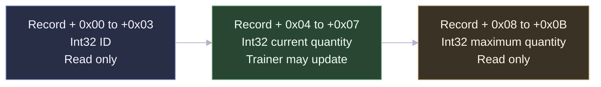

```text
Record Address = Player + 0x344 + Index * 0x0C
```

Examples:

```text
Record 0 = Player + 0x344
Record 1 = Player + 0x350
Record 2 = Player + 0x35C
```

### Inventory Auto-Max Flow

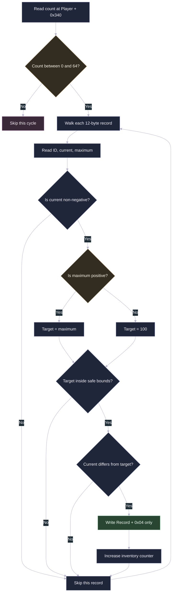

The trainer never writes the item ID or maximum field.

---

## Magazine Pointer Chain

The active magazine is separate from the player inventory records.


```text
m0 = read_u32(module_base + 0x671890)
m1 = read_u32(m0 + 0x00)
m2 = read_u32(m1 + 0x4C4)
magazine_address = m2 + 0x144
```

### Linear Magazine Object View

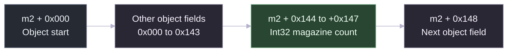

### Magazine Auto-Fill Flow

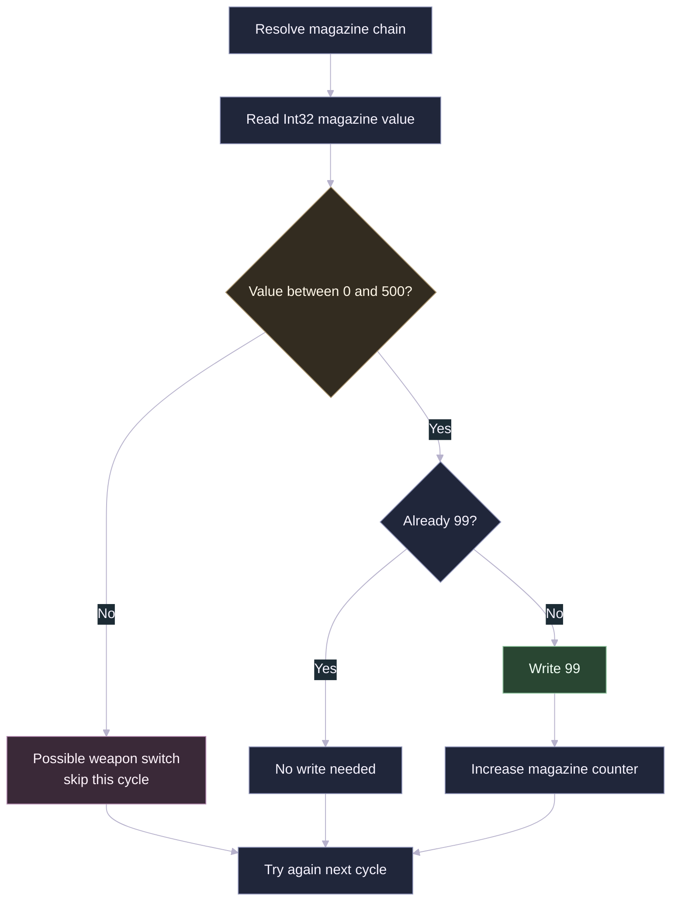

A temporary value such as `-1` during a weapon switch is ignored for that cycle. The feature remains enabled and tries again.

---

## Real-Time Worker Loop

The worker checks the game every **25 milliseconds**, which is approximately **40 cycles per second**.

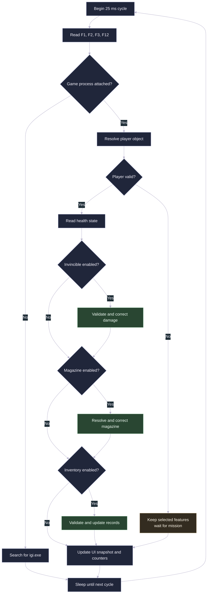

If a read fails during a loading screen or transition, the trainer skips that cycle. The selected feature is not automatically turned off.

---

## Application Architecture

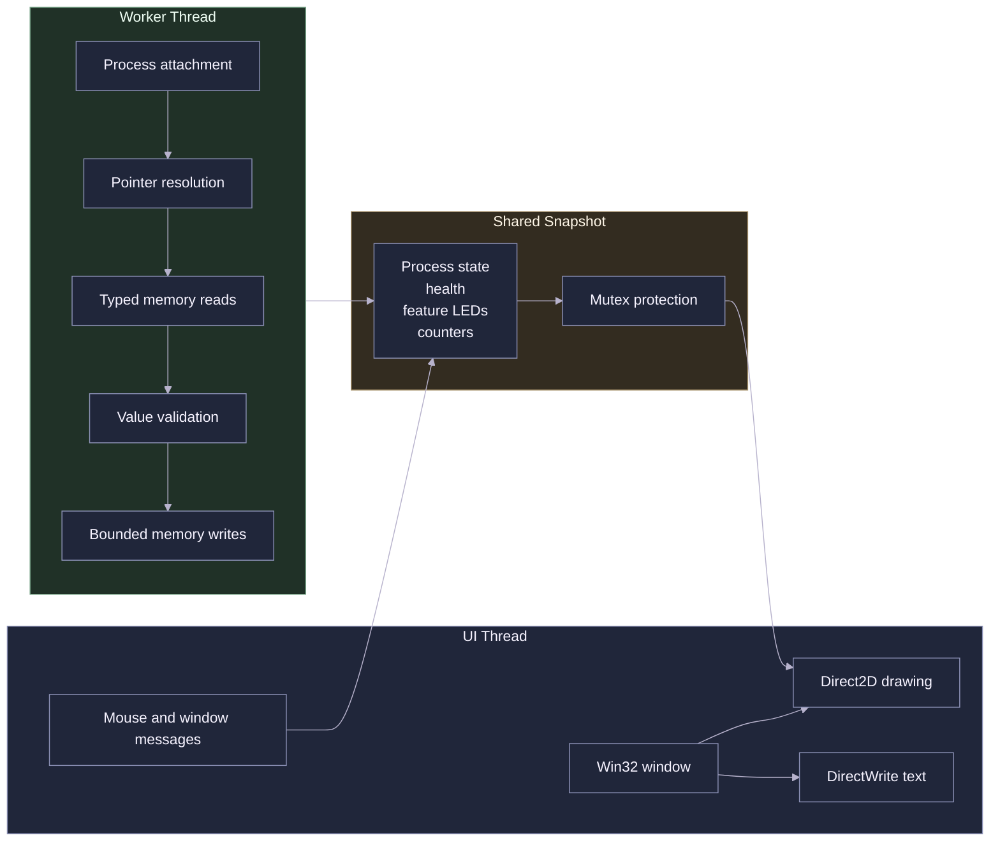

### Source Layout

```text
src/App.cpp             Window, drawing, controls, status display
src/GameTrainer.cpp     Worker loop and feature policies
src/ProcessMemory.cpp   Process discovery and typed memory access
src/main.cpp            Windows entry point
include/Offsets.hpp     Known offsets, targets, and limits
```

---

## Validation Before Every Write

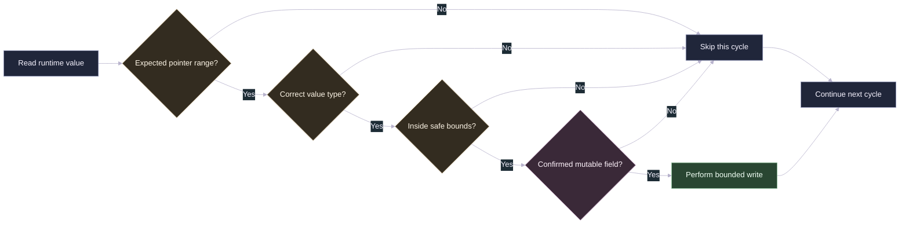

### Fields the Trainer May Change

```text
Player + 0x254       Accumulated damage
Record + 0x04        Inventory current quantity
Chain result + 0x144 Active magazine count
```

### Fields the Trainer Does Not Change

```text
Inventory item IDs
Inventory maximum values
Game executable code
Game files on disk
Windows system files
Other running processes
```

---

## Build from Source

### Requirements

- Windows 10 or Windows 11
- Visual Studio Community 2026
- Desktop development with C++
- MSVC x86 build tools
- Windows SDK
- CMake

### Build Command

```powershell
cmd.exe /d /s /c 'call "C:\Program Files\Microsoft Visual Studio\18\Community\VC\Auxiliary\Build\vcvarsall.bat" x86 && cd /d "PATH\TO\Project-IGI-Offline-Trainer" && if exist build rmdir /s /q build && cmake -S . -B build -G "NMake Makefiles" -DCMAKE_BUILD_TYPE=Release && cmake --build build'
```

Expected file:

```text
build\bin\IGI-Offline-Trainer.exe
```

---

## Repository Layout

```text
Project-IGI-Offline-Trainer/
├── .github/
├── assets/
│   ├── gifs/
│   └── images/
├── docs/
├── include/
├── resources/
├── src/
├── CMakeLists.txt
├── BUILD.md
├── LICENSE
├── LEGAL.md
├── README.md
└── SECURITY.md
```

---

## Compatibility

### Supported

- Windows 10 or Windows 11
- 64-bit Windows host
- Compatible original 32-bit Project I.G.I. executable
- Offline single-player missions

### Not Supported

- Online or competitive games
- Anti-cheat systems
- Other games
- Other Project I.G.I. titles
- Executables with a different memory layout

The memory offsets are version-specific. A different executable can move the module roots, pointer steps, player fields, inventory table, or magazine field.

---

## Project Scope

- Offline single-player use only
- Users must supply a lawfully obtained compatible game copy
- No game executable, DLL, map, model, texture, audio, font, or proprietary source code is included
- The project is unofficial and is not affiliated with or endorsed by the game's rights holders

See [LEGAL.md](LEGAL.md), [LICENSE](LICENSE), and [SECURITY.md](SECURITY.md) for the full project terms.

---

## Project Status

This is a learning project and is not under active maintenance. The source code is available for review, modification, and independent compilation under the repository license.

Improvements are welcome when they remain inside the authorized offline single-player scope.

---

<div align="center">

## Built to Beat One Mission

*That helicopter. That tank. That Dragunov guard. One childhood challenge that became a complete technical project.*

**Go back to Border Crossing and finish it your way.**

[Download the Latest Release](../../releases/latest) • [Build from Source](BUILD.md)

<br>

**Designed and developed by TJM**

</div>
