<div align="center">

# IGI Offline Trainer

### A childhood mission I could never quite finish. A curiosity that never quite left.

</div>

---

## Remember Border Crossing?

<div align="center">

<!-- THE hero shot. Get to the chokepoint where the Dragunov guard sits and grab your screenshot there — that's the moment this whole project is named after. -->
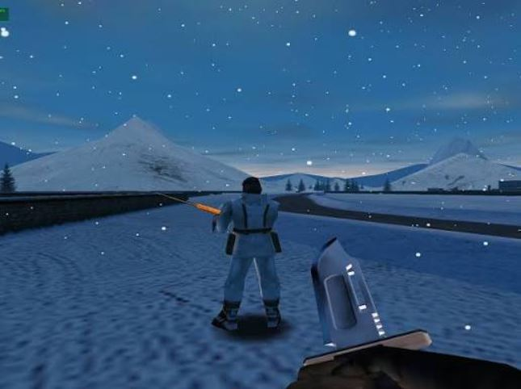

</div>

Project I.G.I. has been one of my favorite games since I first played it back in 2008. Like a lot of players, I kept hitting missions that felt almost impossible to get through on a kid's patience and a kid's reflexes. The one I remember most is **Border Crossing** — the single most terrifying mission of all time, where one particular guard holding a Dragunov got killed roughly one million times by yours truly. 😂

I'd creep through it carefully — searching for a safe route, rationing every bullet, trying not to take a single unnecessary hit. And then, without fail, that helicopter would show up. Circling overhead. Hunting.

What made it across the line, mission after mission:

- Limited health
- Reduced ammunition
- Very little cover
- One specific guard with a Dragunov who apparently could not be killed enough times to make peace with it
- The helicopter attacking from above, and a tank hunting you down — it felt less like a mission and more like a mission-fail simulator
- Another restart
- Another attempt at crossing the exact same stretch of dangerous ground

That memory stayed with me for years, long after I'd stopped actively playing.

Much later, instead of just going looking for another shortcut or a walkthrough, I got curious about something else entirely: *how does the game actually store all of this?* Where does it keep player health, accumulated damage, magazine ammunition, inventory quantities? That curiosity is what turned into my first real reverse-engineering project.

What started as a childhood gaming grudge slowly became a full technical learning journey through:

- Runtime memory observation
- Static analysis
- Pointer-chain discovery
- Health and damage calculation
- Inventory-record analysis
- Magazine-state research
- Defensive memory validation
- Native Windows interface development
- Direct2D rendering
- Build automation
- Public-source documentation

**IGI Offline Trainer** was built out of that journey.

It's meant for players who remember getting stuck at sections like Border Crossing and want to go back through the game on their own terms — a calmer, offline, single-player experience. It's also, honestly, just a personal tribute to a childhood game that stuck with me far longer than I expected.

> A favorite childhood game. A brutal border crossing. A helicopter that never let up. One unforgettable mission that, years later, became my first reverse-engineering project.

<div align="center">

<!-- Add a personally recorded, lawful offline gameplay screenshot here. Remove usernames, folder paths, and any desktop notifications before uploading. -->


**The Approach**
*Carefully entering the exposed section of Border Crossing.*

<br>

<!-- Add a personally recorded, lawful offline gameplay screenshot here. -->


**That Helicopter**
*Circling above, and constantly attacking.*

<br>

<!-- Add a personally recorded, lawful offline gameplay screenshot here. -->
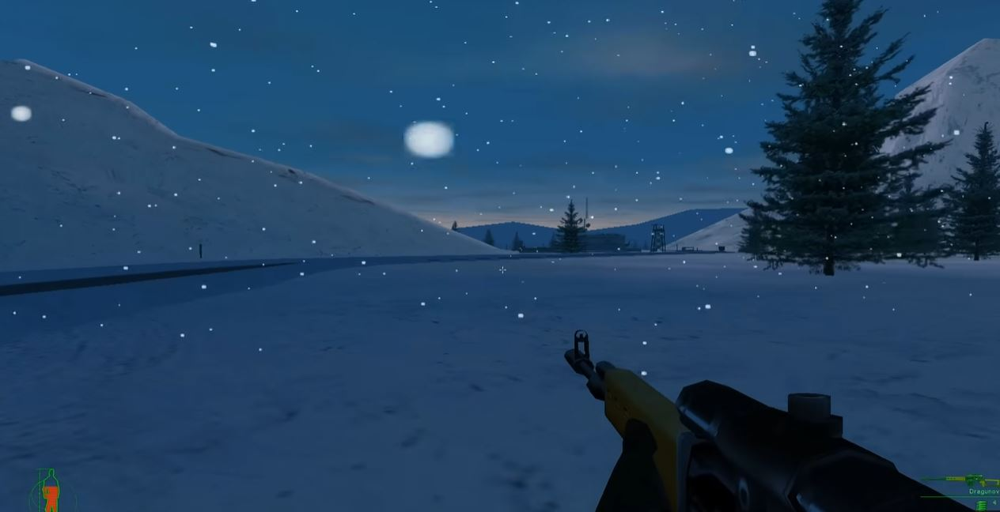

**Stuck Again**
*Limited health, limited ammunition, and another attempt to survive.*

</div>

These moments are the experience that inspired the trainer: pushing through the mission, losing health, running short on ammunition, hunting for cover, and getting stopped by the same helicopter again and again.

> *All screenshots above should come from personally recorded, lawful offline gameplay. Before publishing, remove usernames, folder paths, desktop notifications, or any other private information.*

<div align="center">

<!-- Add a short gameplay GIF of Border Crossing here once recorded — see the "Media and Visual Assets" section below for size/format guidance. -->


*Space reserved for a Border Crossing gameplay GIF — drop yours in at `assets/gifs/border-crossing-demo.gif`.*

</div>

---

<div align="center">

## Professional GPU-Rendered Offline Gameplay Utility

*Minimal Direct2D interface for health protection, magazine auto-fill, and dynamic inventory management in an authorized offline Project I.G.I. installation*

**Direct2D • C++20 • Win32 • x86 • Visual Studio 2026 • No Game Files Included**

[Download the Latest Compiled Release](../../releases/latest)

</div>

---

## Overview

IGI Offline Trainer is a professional Windows desktop utility designed for authorized offline, single-player experimentation with Project I.G.I. The application combines a minimal GPU-rendered Direct2D interface with persistent gameplay policies, strict memory validation, dynamic pointer resolution, live LED status indicators, and per-feature correction counters.

The C++20 implementation preserves the operational behavior confirmed by the author's working Python v2 prototype and technical research. It is configured for the specific 32-bit executable layout used during development. Runtime heap addresses may move between missions, so the application resolves the required object chains continuously rather than storing final addresses permanently.

> **Offline use only:** This project must not be used with networked games, competitive environments, anti-cheat systems, unauthorized copies, third-party computers, or remote services.

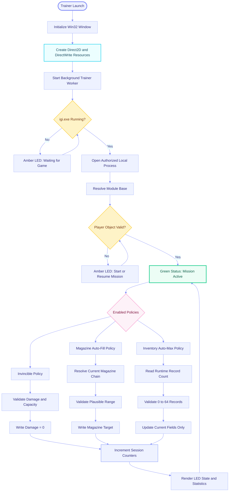

---

## Key Features

### **Persistent Gameplay Policies**

- **F1 Invincible:** Maintains the confirmed accumulated-damage field at zero while enabled
- **F2 Magazine Auto-Fill:** Maintains the current weapon magazine at the configured target
- **F3 Inventory Auto-Max:** Continuously updates every valid runtime inventory record
- **F12 Emergency Disable:** Immediately disables all active gameplay policies
- Policies remain enabled through temporary loading, weapon switching, and object-transition states
- Invalid data skips only the current polling cycle instead of disabling the selected feature

### **Minimal GPU-Rendered Interface**

- Native Win32 desktop application
- Direct2D GPU-accelerated card rendering
- DirectWrite typography
- No browser engine, Electron runtime, or embedded web view
- Three focused feature cards with hotkey labels
- Live process, mission, health, feature, and session-correction status
- Compact About dialog with scope and authorship information

### **Professional LED Status System**

- **Green:** Feature enabled and latest runtime state validated successfully
- **Amber:** Feature enabled but temporarily waiting for a valid mission object or transition
- **Gray:** Feature disabled
- **Red:** Reserved for persistent access or compatibility failure
- Session counters display successful corrections performed by each feature

### **Defensive Runtime Validation**

- Every pointer is checked before dereferencing
- Runtime player object is resolved repeatedly
- Inventory count is limited to a conservative safe range
- Health values must be finite and capacity must be positive
- Magazine values must remain inside a plausible range
- Inventory ID and maximum fields are never modified
- Only independently confirmed mutable fields are eligible for writes

### **Privacy-First Local Operation**

- No telemetry
- No remote analytics
- No account system
- No cloud dependency
- No remote logging
- No network service
- No DLL injection
- No hooks
- No game executables or proprietary game assets included

---

## Interface Experience

```mermaid
%%{init: {'theme':'base', 'themeVariables': { 'primaryColor':'#ECFEFF','primaryTextColor':'#164E63','primaryBorderColor':'#67E8F9','lineColor':'#818CF8','secondaryColor':'#EEF2FF','tertiaryColor':'#ECFDF5'}}}%%
graph LR
    subgraph Header[Application Header]
        Brand[IGI Trainer]
        Scope[Offline Single-Player Utility]
        ProcessLED[Live Process LED]
    end

    subgraph Cards[Feature Cards]
        Invincible[Invincible Card<br/>F1 and Correction Count]
        Magazine[Magazine Auto-Fill Card<br/>F2 and Refill Count]
        Inventory[Inventory Auto-Max Card<br/>F3 and Record Update Count]
    end

    subgraph Footer[Status and Actions]
        Health[Calculated Health Percentage]
        About[About Dialog]
        Exit[Safe Exit]
    end

    Header --> Cards
    Cards --> Footer

    style Brand fill:#EEF2FF,stroke:#A5B4FC,stroke-width:2px,color:#312E81
    style Scope fill:#ECFEFF,stroke:#67E8F9,stroke-width:2px,color:#164E63
    style ProcessLED fill:#ECFDF5,stroke:#6EE7B7,stroke-width:2px,color:#065F46
    style Invincible fill:#FDF2F8,stroke:#F9A8D4,stroke-width:2px,color:#831843
    style Magazine fill:#FEF3C7,stroke:#FCD34D,stroke-width:2px,color:#78350F
    style Inventory fill:#EEF2FF,stroke:#A5B4FC,stroke-width:2px,color:#312E81
    style Health fill:#ECFDF5,stroke:#6EE7B7,stroke-width:2px,color:#065F46
```

### Minimal UI Layout

```text
┌────────────────────────────────────────────────┐
│  IGI TRAINER                         ● READY   │
│  Offline single-player utility                 │
├────────────────────────────────────────────────┤
│  ●  INVINCIBLE                           [F1]  │
│     Maintains accumulated damage at zero       │
│                               18 corrections   │
├────────────────────────────────────────────────┤
│  ●  MAGAZINE AUTO-FILL                   [F2]  │
│     Maintains the active magazine target       │
│                               73 corrections   │
├────────────────────────────────────────────────┤
│  ●  INVENTORY AUTO-MAX                   [F3]  │
│     Maintains active inventory quantities      │
│                              156 corrections   │
├────────────────────────────────────────────────┤
│  HEALTH 100.0%       Click a card or hotkey    │
│  [ About ]                              [ Exit ]│
└────────────────────────────────────────────────┘
```

### Live Demo GIFs

<div align="center">

<!-- Add your recorded trainer demo GIFs here. Suggested size: 960x540, 15-20 FPS. See "Media and Visual Assets" below for the exact ImageMagick command. -->


*Overview: launching the trainer, attaching to the game, and the live LED status.*

<br>

 

*Left: Invincible in action. Right: Magazine Auto-Fill surviving a weapon switch.*

<br>


*Inventory Auto-Max keeping every carried item topped up in real time.*

</div>

---

## System Requirements

```mermaid
%%{init: {'theme':'base', 'themeVariables': { 'primaryColor':'#FDF2F8','primaryTextColor':'#831843','primaryBorderColor':'#F9A8D4','lineColor':'#F9A8D4','secondaryColor':'#ECFEFF','tertiaryColor':'#FEF3C7'}}}%%
graph LR
    subgraph Runtime[Runtime Requirements]
        OS[Windows 10 or 11<br/>64-bit Host]
        Game[Lawfully Obtained<br/>32-bit Project I.G.I.]
        Mode[Offline Single-Player<br/>Mission]
    end

    subgraph Build[Build Requirements]
        VS[Visual Studio Community 2026]
        Workload[Desktop Development with C++]
        MSVC[MSVC x64 and x86 Tools]
        SDK[Windows 11 SDK 10.0.26100]
        CMake[CMake 3.21 or Newer]
        Git[Git for Repository Operations]
    end

    Runtime --> Build

    style OS fill:#E0F2FE,stroke:#7DD3FC,stroke-width:2px,color:#075985
    style Game fill:#FDF2F8,stroke:#F9A8D4,stroke-width:2px,color:#831843
    style Mode fill:#ECFDF5,stroke:#6EE7B7,stroke-width:2px,color:#065F46
    style VS fill:#EEF2FF,stroke:#A5B4FC,stroke-width:2px,color:#312E81
    style Workload fill:#FEF3C7,stroke:#FCD34D,stroke-width:2px,color:#78350F
    style MSVC fill:#ECFEFF,stroke:#67E8F9,stroke-width:2px,color:#164E63
    style SDK fill:#ECFDF5,stroke:#6EE7B7,stroke-width:2px,color:#065F46
    style CMake fill:#EEF2FF,stroke:#A5B4FC,stroke-width:2px,color:#312E81
    style Git fill:#FDF2F8,stroke:#F9A8D4,stroke-width:2px,color:#831843
```

### Required Visual Studio Components

Open **Visual Studio Installer**, select **Modify** for Visual Studio Community 2026, and verify:

- **Desktop development with C++** workload
- MSVC C++ x64/x86 build tools
- C++ CMake tools for Windows
- Windows 11 SDK `10.0.26100.0` or a compatible installed SDK
- C++ core desktop features
- Windows Resource Compiler

### Build Environment Verification

Use **Developer PowerShell for Visual Studio 2026** and run:

```powershell
where.exe cmake
where.exe cl
where.exe link
where.exe rc
cmake --version
cmake --help | Select-String "Visual Studio"
```

The required compiler target is **Win32/x86**, because the supported game executable and documented pointer model use the 32-bit address space.

---

## Build Process

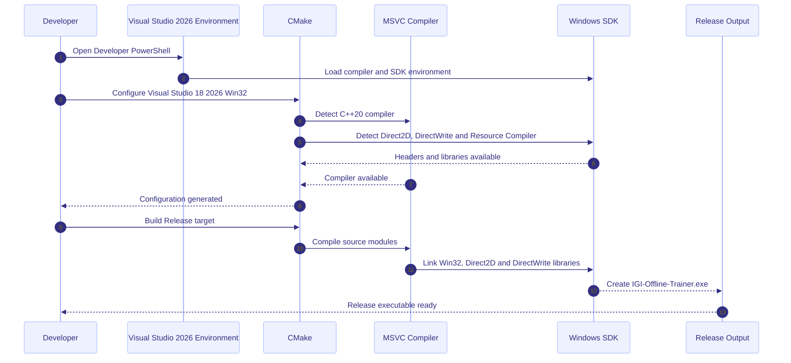

### Recommended Local Build

Open **Developer PowerShell for Visual Studio 2026**:

```powershell
cd "FULL\PATH\TO\IGI-Offline-Trainer"

cmake -S . -B build -G "Visual Studio 18 2026" -A Win32
cmake --build build --config Release --parallel
```

Expected executable:

```text
build\bin\Release\IGI-Offline-Trainer.exe
```

### CMake Preset Build

```powershell
cmake --preset windows-x86-release
cmake --build --preset release
```

Expected executable:

```text
out\build\x86-release\bin\Release\IGI-Offline-Trainer.exe
```

### Clean Rebuild

```powershell
if (Test-Path ".\build") {
    Remove-Item ".\build" -Recurse -Force
}

cmake -S . -B build -G "Visual Studio 18 2026" -A Win32
cmake --build build --config Release --parallel
```

---

## Usage Workflow

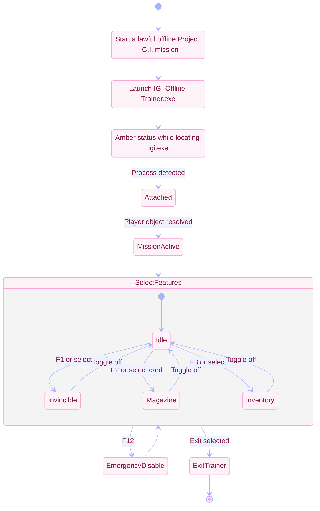

### Step-by-Step Usage

1. Start a lawful offline Project I.G.I. mission.
2. Launch `IGI-Offline-Trainer.exe`.
3. Wait for the process status to indicate that `igi.exe` is attached.
4. Wait for the mission state to become active.
5. Select a feature card or use F1, F2, or F3.
6. Observe the LED state and correction counter.
7. Press F12 to disable all features immediately.
8. Exit the trainer before leaving the offline session.

### Hotkeys

```text
F1   Toggle Invincible
F2   Toggle Magazine Auto-Fill
F3   Toggle Inventory Auto-Max
F12  Emergency Disable All Features
```

---

## Runtime Architecture

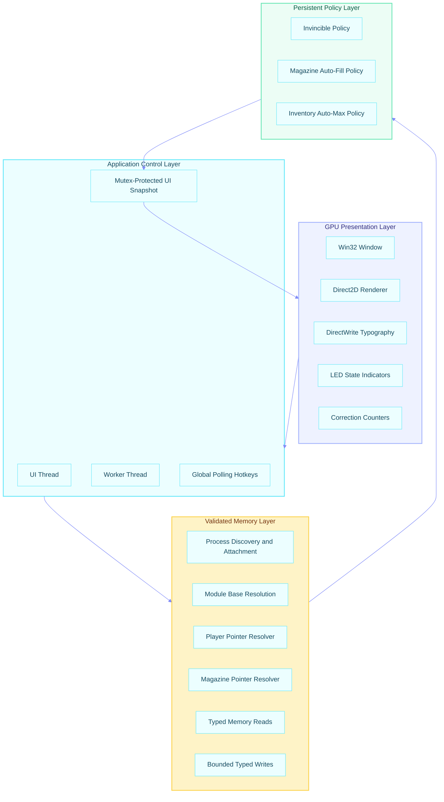

### Architecture Components

- **Win32 application shell:** Creates and manages the native Windows application window
- **Direct2D:** Renders the background, cards, controls, borders, and LED indicators
- **DirectWrite:** Renders clean text and live numeric information
- **UI thread:** Owns all graphical resources and processes application messages
- **Worker thread:** Owns attachment, pointer resolution, validation, and bounded update policies
- **Snapshot bridge:** Shares only the small current UI state under mutex protection
- **Process memory layer:** Provides typed read and write operations through Windows APIs
- **Policy layer:** Applies only explicitly enabled and validated gameplay policies

---

## Health and Damage Model

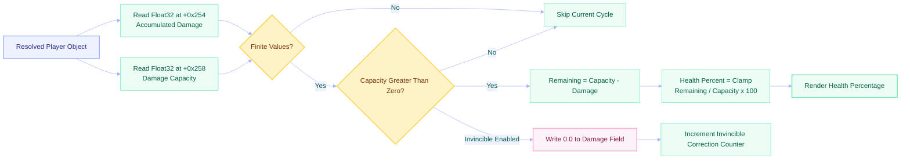

### Confirmed Fields

```text
player + 0x254  Float32  Accumulated damage
player + 0x258  Float32  Damage capacity / lethal threshold
```

### Health Formula

```text
remaining_health = max(0, damage_capacity - accumulated_damage)
health_percent = clamp(
    remaining_health / damage_capacity * 100,
    0,
    100
)
```

Invincible mode does not write an arbitrary health number. It maintains the confirmed accumulated-damage field at `0.0f` after validating both health fields.

---

## Player Pointer Resolution

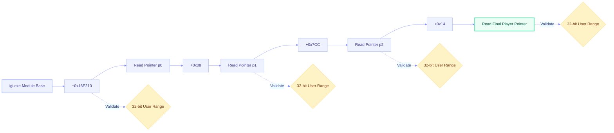

### Resolution Formula

```text
p0     = read_u32(module_base + 0x16E210)
p1     = read_u32(p0 + 0x08)
p2     = read_u32(p1 + 0x7CC)
player = read_u32(p2 + 0x14)
```

The module-relative root is stable for the supported executable layout. The final player object is dynamically allocated and may move after mission transitions, loading screens, or restart events.

---

## Inventory Management

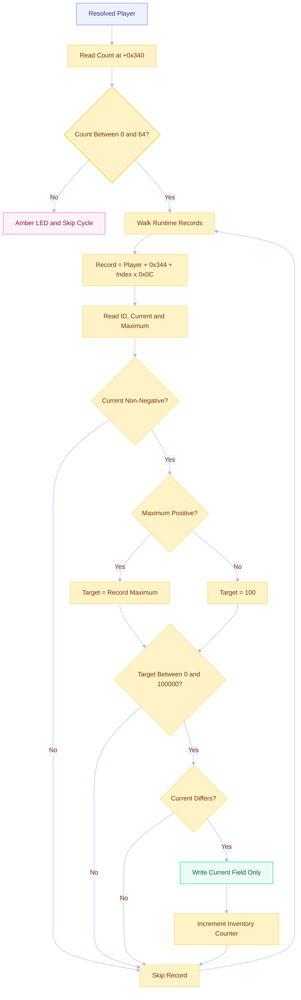

### Runtime Record Structure

```cpp
struct InventoryRecord {
    std::int32_t id;       // +0x00, read-only
    std::int32_t current;  // +0x04, bounded mutable field
    std::int32_t maximum;  // +0x08, read-only
};
```

### Inventory Formulas

```text
count_address   = player + 0x340
record_address  = player + 0x344 + index * 0x0C
id_address      = record_address + 0x00
current_address = record_address + 0x04
maximum_address = record_address + 0x08
```

### Inventory Safety Rules

- Reject record counts below `0` or above `64`
- Never write the record ID
- Never write the record maximum
- Skip negative current values
- Respect a positive maximum
- Use `100` only for an unclamped or non-positive maximum
- Reject targets above `100000`
- Increment the counter only after a successful write

---

## Magazine Management

```mermaid
%%{init: {'theme':'base', 'themeVariables': { 'primaryColor':'#FDF2F8','primaryTextColor':'#831843','primaryBorderColor':'#F9A8D4','lineColor':'#818CF8','secondaryColor':'#EEF2FF','tertiaryColor':'#ECFDF5'}}}%%
flowchart LR
    Base[igi.exe Module Base] --> Root[+0x671890]
    Root --> M0[Read m0]
    M0 --> Step1[+0x00]
    Step1 --> M1[Read m1]
    M1 --> Step2[+0x4C4]
    Step2 --> M2[Read m2]
    M2 --> Final[+0x144]
    Final --> Current[Read Current Magazine]
    Current --> Plausible{Value Between 0 and 500?}
    Plausible -->|No| Transition[Amber LED: Skip Transition]
    Plausible -->|Yes| Target{Already 99?}
    Target -->|Yes| Active[Green LED: No Write Needed]
    Target -->|No| Write[Write Magazine = 99]
    Write --> Counter[Increment Refill Counter]

    style Base fill:#EEF2FF,stroke:#A5B4FC,stroke-width:2px,color:#312E81
    style Plausible fill:#FEF3C7,stroke:#FCD34D,stroke-width:2px,color:#78350F
    style Transition fill:#FDF2F8,stroke:#F9A8D4,stroke-width:2px,color:#831843
    style Active fill:#ECFDF5,stroke:#6EE7B7,stroke-width:2px,color:#065F46
    style Write fill:#ECFEFF,stroke:#67E8F9,stroke-width:2px,color:#164E63
```

### Magazine Chain

```text
m0 = read_u32(module_base + 0x671890)
m1 = read_u32(m0 + 0x00)
m2 = read_u32(m1 + 0x4C4)
magazine_address = m2 + 0x144
```

Magazine state is resolved independently from inventory reserve quantities. Transitional values, including weapon-switch states, are skipped without disabling the feature.

---

## Repository Structure

```text
IGI-Offline-Trainer/
├── .github/
│   ├── ISSUE_TEMPLATE/
│   │   ├── bug_report.yml
│   │   └── feature_request.yml
│   ├── workflows/
│   │   ├── build.yml
│   │   └── release.yml
│   └── pull_request_template.md
├── assets/
│   ├── gifs/
│   │   ├── README.md
│   │   ├── border-crossing-demo.gif
│   │   ├── trainer-overview.gif
│   │   ├── invincible-demo.gif
│   │   ├── magazine-demo.gif
│   │   └── inventory-demo.gif
│   └── images/
│       ├── README.md
│       ├── border-crossing-01.JPG
│       ├── border-crossing-02.JPG
│       ├── border-crossing-03.JPG
│       ├── border-crossing-hero.JPG
│       ├── hero-1600x900.png
│       ├── ui-preview-1200x800.png
│       └── social-preview-1280x640.png
├── docs/
│   ├── ARCHITECTURE.md
│   └── RELEASE.md
├── include/
│   ├── App.hpp
│   ├── GameTrainer.hpp
│   ├── Offsets.hpp
│   └── ProcessMemory.hpp
├── resources/
│   └── app.rc
├── src/
│   ├── App.cpp
│   ├── GameTrainer.cpp
│   ├── ProcessMemory.cpp
│   └── main.cpp
├── .gitattributes
├── .gitignore
├── CHANGELOG.md
├── CMakeLists.txt
├── CMakePresets.json
├── CONTRIBUTING.md
├── LEGAL.md
├── LICENSE
├── README.md
├── SECURITY.md
└── THIRD_PARTY_NOTICES.md
```

---

## Media and Visual Assets

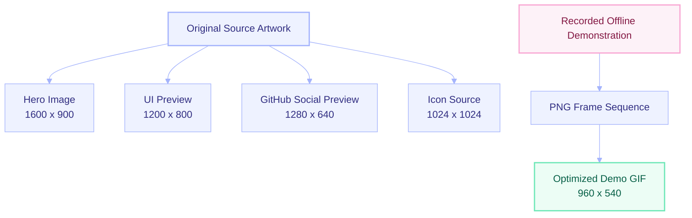

### Recommended File Sizes

- Hero image: `1600 x 900`
- UI screenshot: `1200 x 800`
- Social preview: `1280 x 640`
- Application icon source: `1024 x 1024`
- Border Crossing screenshots: `1600 x 900` (or your native capture resolution)
- Demo GIF: `960 x 540`, 15 to 20 FPS

### ImageMagick Commands

Hero image:

```powershell
magick input.png -resize 1600x900^ -gravity center -extent 1600x900 assets/images/hero-1600x900.png
```

GitHub social preview:

```powershell
magick input.png -resize 1280x640^ -gravity center -extent 1280x640 assets/images/social-preview-1280x640.png
```

Windows icon:

```powershell
magick input.png -define icon:auto-resize=256,128,64,48,32,16 assets/app.ico
```

GIF from PNG frames:

```powershell
magick -delay 5 -loop 0 frames/frame-*.png -resize 960x540 -layers Optimize assets/gifs/trainer-demo.gif
```

Use only original artwork, original screenshots, or media that you have permission to publish. Do not include extracted game textures, logos, models, audio, maps, or other proprietary assets.

---

## GitHub Actions and Release Process

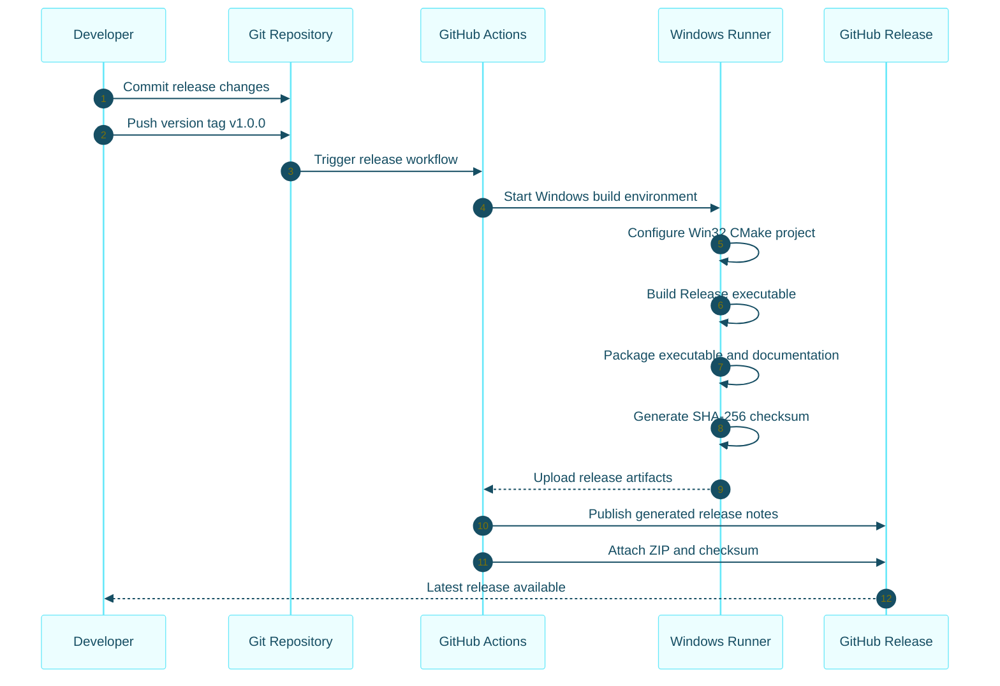

### Create the First Release

```powershell
git add .
git commit -m "Release IGI Offline Trainer v1.0.0"
git push origin main

git tag v1.0.0
git push origin v1.0.0
```

The release workflow creates:

```text
IGI-Offline-Trainer-Windows-x86-v1.0.0.zip
checksums-sha256.txt
```

### Direct Release Link

[Download the Latest Compiled Release](../../releases/latest)

The direct link begins working after the repository has at least one published GitHub release.

---

## Compatibility and Validation

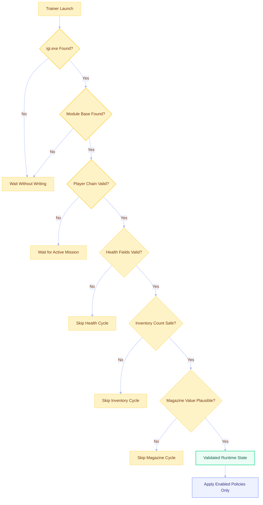

### Supported Build Statement

This repository is configured for the specific 32-bit Project I.G.I. executable layout used by the author during development and Python v2 testing. The C++ implementation preserves the same offsets, field meanings, policy behavior, validation limits, and transition handling.

The C++ version was statically reviewed in the repository-generation environment. The game itself was not available in that environment, so runtime validation must be completed by the author against the already tested local game build before publishing the first compiled release.

Other releases, patches, storefront editions, or modified executables may use different memory layouts and are not guaranteed to work.

---

## Troubleshooting

### Game Status Remains Amber

Possible causes:

- `igi.exe` is not running
- The game is at the menu instead of inside a mission
- The player object has not been initialized
- The executable layout differs from the supported build
- Windows denied access to the target process

Recommended response:

1. Start a lawful offline mission.
2. Launch the trainer after the mission loads.
3. Confirm both applications run under the same Windows user context.
4. Verify that the game executable is named `igi.exe`.
5. Confirm that the local executable is the same build used during offset validation.

### LED Changes to Amber During Weapon Switching

This is expected behavior. The magazine chain may temporarily resolve to an invalid or transitional value. The trainer skips that polling cycle and keeps the policy enabled.

### Inventory Counter Does Not Increase

The counter increases only when a valid record actually requires correction. No increment occurs when every current value already equals its target.

### Health Shows Zero or Does Not Update

The application rejects non-finite damage values, non-finite capacity values, and capacity less than or equal to zero. Start or resume a mission and allow the player object to initialize.

### Resource Compiler Not Found

Open **Developer PowerShell for Visual Studio 2026** rather than ordinary PowerShell. Verify:

```powershell
where.exe rc
```

If required for the current session, add the installed x86 Windows SDK tools:

```powershell
$env:Path = "C:\Program Files (x86)\Windows Kits\10\bin\10.0.26100.0\x86;$env:Path"
```

### CMake Generator Not Found

List installed generators:

```powershell
cmake --help | Select-String "Visual Studio"
```

For Visual Studio Community 2026, use the exact generator name printed by CMake, expected as:

```text
Visual Studio 18 2026
```

---

## Security and Privacy Architecture

```mermaid
%%{init: {'theme':'base', 'themeVariables': { 'primaryColor':'#ECFDF5','primaryTextColor':'#065F46','primaryBorderColor':'#6EE7B7','lineColor':'#A5B4FC','secondaryColor':'#EEF2FF','tertiaryColor':'#FEF3C7'}}}%%
graph LR
    subgraph Boundaries[Project Boundaries]
        Offline[Offline Single-Player Only]
        Local[Local Process Only]
        NoInjection[No DLL Injection]
        NoHooks[No Runtime Hooks]
        NoNetwork[No Network Features]
    end

    subgraph Validation[Validation Controls]
        Pointer[Pointer Range Validation]
        Float[Finite Float Validation]
        Count[Inventory Count Limit]
        Bounds[Write Target Bounds]
        Fields[Confirmed Fields Only]
    end

    subgraph Privacy[Privacy Controls]
        NoTelemetry[No Telemetry]
        NoAccount[No Account]
        NoRemoteLog[No Remote Logging]
        SessionOnly[Session-Only Counters]
        NoSecrets[No Credentials Required]
    end

    Boundaries --> Validation
    Validation --> Privacy

    style Boundaries fill:#EEF2FF,stroke:#A5B4FC,stroke-width:2px,color:#312E81
    style Validation fill:#FEF3C7,stroke:#FCD34D,stroke-width:2px,color:#78350F
    style Privacy fill:#ECFDF5,stroke:#6EE7B7,stroke-width:2px,color:#065F46
```

### Security Rules

- No support for online games or competitive play
- No anti-cheat bypass
- No stealth or detection-evasion functionality
- No authentication or entitlement bypass
- No DRM circumvention
- No credential, cookie, token, or session access
- No kernel drivers
- No process injection
- No modification of unrelated processes
- No proprietary game content in source or releases

### Repository Hygiene

Never commit:

```text
*.pfx
*.p12
*.key
*.pem
.env
igi.exe
Game DLL files
Private logs
Personal absolute paths
Authentication data
Signing passwords
Crash dumps containing identifiers
```

---

## Support and Maintenance

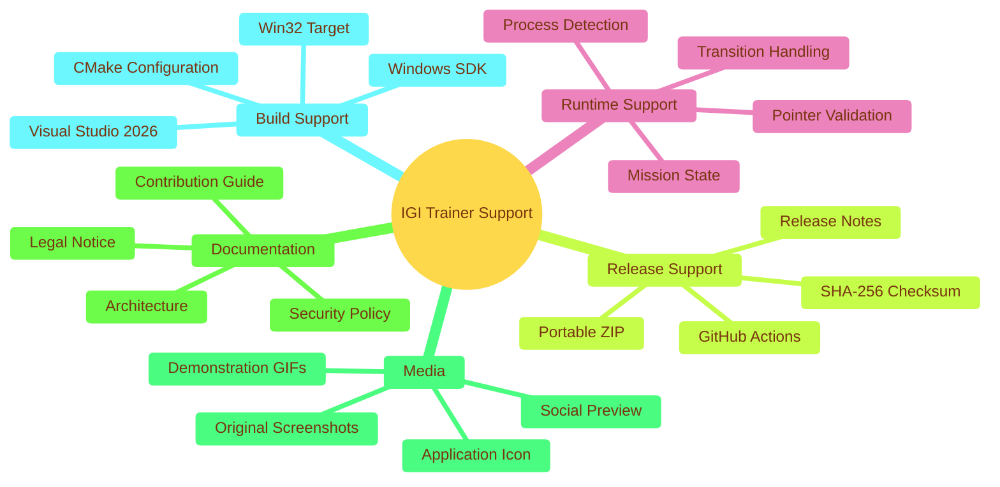

### Bug Reports

A useful public bug report should include:

- Trainer release version
- Windows version
- Build type, such as Win32 Release
- Visual Studio and CMake version if reporting a build issue
- Whether `igi.exe` was detected
- Whether an offline mission was active
- LED color and affected feature
- Reproduction steps
- Sanitized error information

Do not upload game executables, proprietary assets, private paths, tokens, certificates, or personal information.

---

## Professional Standards

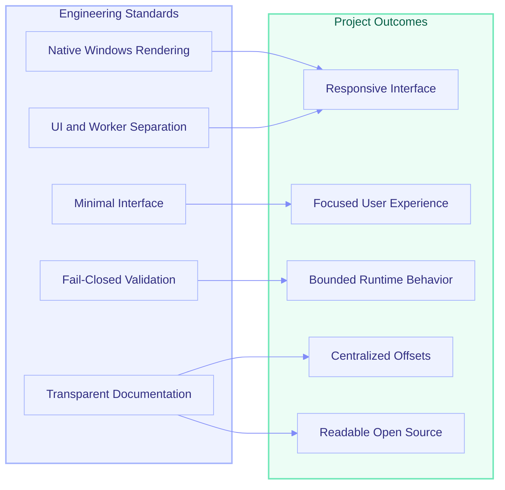

### Engineering Principles

- Minimal UI instead of decorative complexity
- Centralized offsets instead of scattered constants
- Typed memory access instead of raw unstructured buffers
- Persistent policies instead of one-shot toggles
- Transition awareness instead of permanent feature shutdown
- Session counters instead of noisy console logging
- Explicit offline scope instead of ambiguous positioning
- Honest compatibility statements instead of universal support claims

---

## Notice of Cooperation & Take-Down Policy

I deeply respect the intellectual property rights of game developers and publishers. Please note that this is my very first reverse engineering project made public, and it was created entirely as a personal learning experiment.

If you are an **official copyright holder, authorized legal representative, or publisher** associated with *Project I.G.I.* or related intellectual property and believe this repository conflicts with your intellectual property guidelines:

- **Preferred Contact Method:** Please open an **Issue** or a **Pull Request** directly here on GitHub. This repository is actively monitored.
- **Verification Requirement:** To prevent fraudulent requests or trolling, a request for modification or removal should include reasonable official verification showing authority to act for the relevant rights holder. Sensitive evidence should not be posted publicly. Request a suitable private contact channel where necessary.
- **Commitment to Compliance:** A verified request will be reviewed promptly and in good faith. Appropriate modification, content removal, release removal, or repository take-down action will be taken when required.

This cooperation policy does not limit any legal rights or formal notice mechanisms available to a rights holder, publisher, platform, or authorized representative.

---

## Legal and Intellectual Property

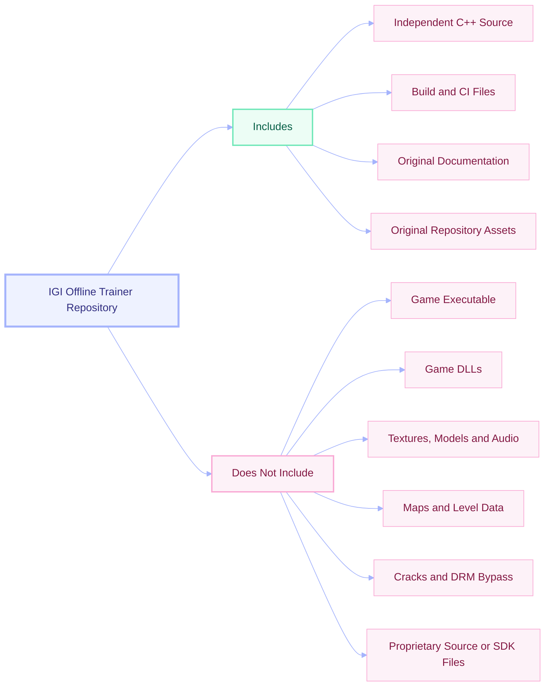

This repository contains independently written source code, project configuration, documentation, and original repository assets. It does not contain the original game executable, DLLs, levels, textures, models, audio, fonts, manuals, cracks, DRM circumvention material, or other proprietary game content.

Project I.G.I. and related names, trademarks, and intellectual property belong to their respective rights holders. This project is unofficial and is not affiliated with, sponsored by, authorized by, or endorsed by those rights holders.

Users must own a lawfully obtained copy of the game and are responsible for complying with applicable law, license terms, and platform rules.

See:

- [Legal Notice](LEGAL.md)
- [MIT License](LICENSE)
- [Security Policy](SECURITY.md)
- [Third-Party Notices](THIRD_PARTY_NOTICES.md)

---

## License

The independently written source code in this repository is provided under the MIT License. The MIT License applies only to the original project code and documentation covered by the repository copyright notice.

The project license does not grant rights to Project I.G.I., its executable, assets, trademarks, or any other third-party intellectual property.

---

## Important Notes

```mermaid
%%{init: {'theme':'base', 'themeVariables': { 'primaryColor':'#FEF3C7','primaryTextColor':'#78350F','primaryBorderColor':'#FCD34D','lineColor':'#A5B4FC','secondaryColor':'#EEF2FF','tertiaryColor':'#FDF2F8'}}}%%
flowchart LR
    Offline[Offline Use Only] --> Lawful[Lawfully Obtained Copy]
    Lawful --> Version[Version-Specific Compatibility]
    Version --> Validate[Runtime Validation Required]
    Validate --> NoAssets[No Proprietary Assets]
    NoAssets --> Responsibility[User Responsibility]

    style Offline fill:#ECFDF5,stroke:#6EE7B7,stroke-width:2px,color:#065F46
    style Version fill:#FEF3C7,stroke:#FCD34D,stroke-width:2px,color:#78350F
    style Responsibility fill:#FDF2F8,stroke:#F9A8D4,stroke-width:2px,color:#831843
```

- This project is restricted to authorized offline single-player experimentation.
- The configured offsets are version-specific.
- Runtime compatibility must be verified before publishing a compiled release.
- Antivirus products may inspect unsigned memory-access utilities more aggressively.
- A compiled release should be signed when a suitable code-signing process is available.
- Publish SHA-256 checksums with every release.
- Never bundle the original game or proprietary game content.
- Keep all public screenshots and GIFs free of personal paths and private information.

---

<div align="center">

## IGI Offline Trainer

### Professional Offline Gameplay Experimentation Utility

*Minimal • Native • Validated • Private • Offline-Only*

*Built from one childhood mission that never stopped nagging at me.*

<br>

**Designed and Developed by TJM**

*First Public Reverse-Engineering Learning Project*

<br>

[Download the Latest Compiled Release](../../releases/latest)

</div>
